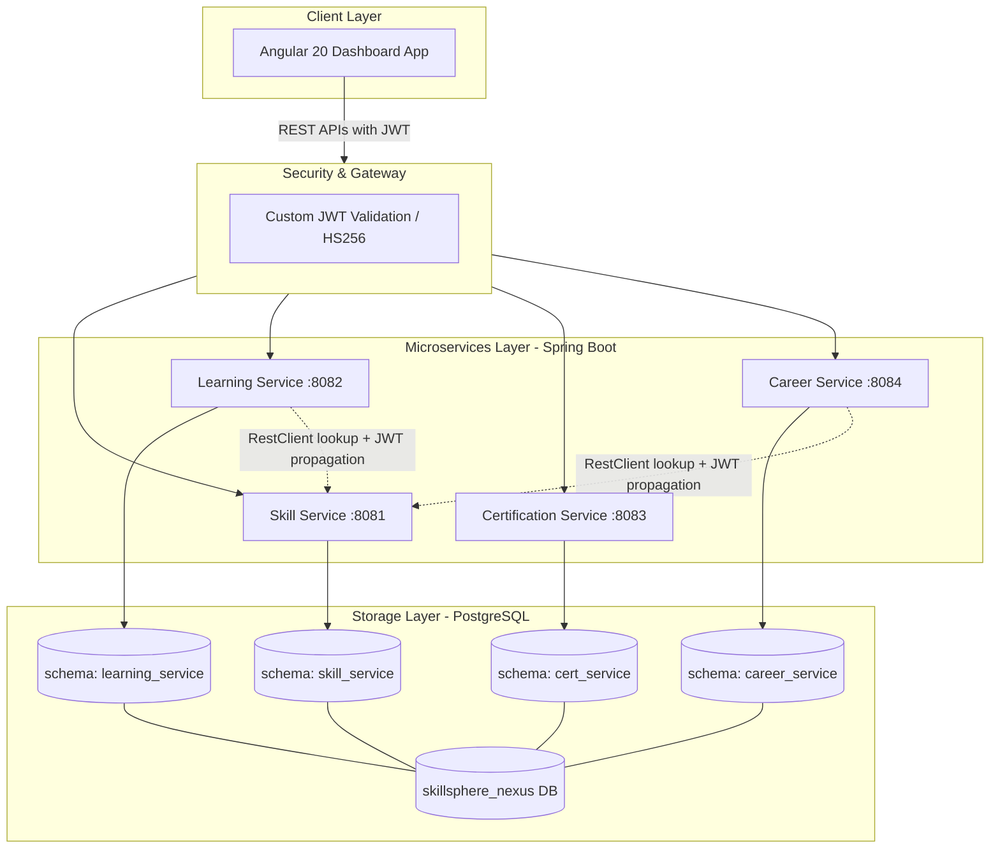

# SkillSphere Nexus 🌌

SkillSphere Nexus is an enterprise-grade Employee Learning, Certification & Career Development platform. It is structured as a monorepo containing 4 independent Spring Boot microservices and a single Angular 20 frontend dashboard.

The services share a single PostgreSQL database instance (with isolated schemas per service) and utilize a custom, stateless JWT-based authentication mechanism.

---

## 📖 Table of Contents

1. [System Architecture](#-system-architecture)
2. [Technology Stack](#-technology-stack)
3. [Repository Structure](#-repository-structure)
4. [Microservices Breakdown](#-microservices-breakdown)
5. [Authentication & Security Design](#-authentication--security-design)
6. [Database & Data Conventions](#-database--data-conventions)
7. [Getting Started & Local Setup](#-getting-started--local-setup)
   - [Prerequisites](#prerequisites)
   - [Environment Variables](#environment-variables)
   - [Running Backend Services](#running-backend-services)
   - [Running Frontend Application](#running-frontend-application)
8. [Testing Guide](#-testing-guide)
9. [API & Frontend Conventions](#-api--frontend-conventions)

---

## 🏗 System Architecture



---

## 🛠 Technology Stack

| Layer | Technology | Version / Implementation |
| :--- | :--- | :--- |
| **Frontend** | Angular 20 | Standalone Components, TypeScript, Signals, Angular Material |
| **Backend** | Java | 21 (LTS) |
| **Framework** | Spring Boot | 3.x |
| **Database** | PostgreSQL | 16 |
| **Database Migrations** | Flyway | Integrates per microservice |
| **Authentication** | Stateless JWT | Custom HS256 sign & verify (no Keycloak/OAuth2 server) |
| **Build Tools** | Maven & npm | Maven for backend services, npm/Angular CLI for frontend |
| **Testing (Backend)** | JUnit 5 & Mockito | Unit & integration tests |
| **Testing (Frontend)** | Jasmine & Karma | Unit & component tests |

---

## 📂 Repository Structure

The monorepo is organized as follows:

```text
skillsphere-nexus/
├── AGENTS.md                 # Agent instructions and system specifications
├── README.md                 # Project main documentation (this file)
├── services/
│   ├── skill-service/        # Spring Boot, port 8081 (Auth, Skills, Employees)
│   ├── learning-service/     # Spring Boot, port 8082 (Courses, Learning Paths)
│   ├── certification-service/# Spring Boot, port 8083 (Certifications, Renewals) - Planned
│   └── career-service/       # Spring Boot, port 8084 (Career Plans, Promotions) - Planned
└── frontend/
    └── skillsphere-app/      # Single Angular 20 dashboard app (modular features)
```

Each Spring Boot service follows standard Clean/Layered Architecture packaging:
```text
com.skillsphere.<service>/
├── controller/     # REST Endpoints
├── service/        # Business Logic & Core Interfaces
├── repository/     # JPA Spring Data Repositories
├── entity/         # Database Entities
├── dto/            # Request/Response Data Transfer Objects (using records)
├── mapper/         # Object Mappers (Entity <-> DTO)
├── exception/      # Custom Exceptions & Global Exception Handlers
├── security/       # JWT Filters & Web Security Configuration
└── config/         # App-specific beans & configuration classes
```

---

## ⚙️ Microservices Breakdown

1. **Skill Service (Port `8081`)**
   * *Core Scope*: Employee profiles, skills registry, competency levels, assessments.
   * *Auth Authority*: Exposes the user registration (`/api/v1/auth/register`) and login (`/api/v1/auth/login`) endpoints. Generates and signs JWT tokens.
2. **Learning Service (Port `8082`)**
   * *Core Scope*: Course listings, learning paths, enrollments, completion tracking.
   * *Integration*: Outbound `RestClient` verification of employee IDs against Skill Service (propagating user JWT).
3. **Certification Service (Port `8083`)** *(Upcoming)*
   * *Core Scope*: Certifications tracking, expiry indicators, renewals management.
4. **Career Service (Port `8084`)** *(Upcoming)*
   * *Core Scope*: Career path logs, progression planning, internal job postings, talent analytics.

---

## 🔐 Authentication & Security Design

The security model of SkillSphere Nexus is custom, stateless, and decentralized:

* **JWT Issuer**: The **Skill Service** authenticates credentials and signs a JWT (HS256) with claims:
  ```json
  {
    "sub": "user-uuid",
    "email": "employee@skillsphere.com",
    "role": "EMPLOYEE",
    "exp": 1719876543
  }
  ```
* **Stateless Validation**: All microservices possess the same `JwtAuthFilter` and read a shared environment variable **`JWT_SECRET`**. Any microservice can independently validate the signature, claims, and expiration of incoming request tokens without calling the Skill Service.
* **Role-Based Access Control (RBAC)**: Supported roles are:
  - `ADMIN`
  - `HR_MANAGER`
  - `TRAINING_MANAGER`
  - `EMPLOYEE`
* **Frontend Authentication**: The Angular application receives the JWT on successful login and stores it in session storage. An Angular `HttpInterceptor` automatically attaches the token to all outgoing API calls in the `Authorization: Bearer <token>` header.

---

## 🗄 Database & Data Conventions

* **Database isolation**: A single PostgreSQL instance is shared, but each microservice is isolated to its own schema (e.g. `skill_service`, `learning_service`).
* **Migrations**: Database schema definitions and additions are versioned and run at startup via **Flyway** migrations located under `src/main/resources/db/migration/` in each service.
* **Service Boundaries**: There are **no foreign key constraints** at the database level across schemas. Connections between entities across microservices are maintained through logical UUID columns (e.g. `employee_id` stored inside the `learning_service.enrollments` table).
* **Audit Fields**: Every table must include `created_at` and `updated_at` timestamp columns.
* **Formatting**: Tables and columns are named using `snake_case` (e.g. `learning_paths`, `enrollment_status`).

---

## 🚀 Getting Started & Local Setup

### Prerequisites

- **Java**: JDK 21
- **Node.js**: v22+
- **Angular CLI**: v20+
- **Database**: PostgreSQL 16+
- **Build Tool**: Apache Maven 3.9+

### Environment Variables

Each microservice relies on the following environment variables. Ensure they are configured in your shell environment:

```bash
# Shared secret for signing & verifying JWT tokens (must be identical across all services)
JWT_SECRET="9a6747f5e5b74c2e8b2b7b5c6e8f0a2d3c4b5a6d7e8f901234567890abcdef12"

# Database Connection Details
SPRING_DATASOURCE_URL="jdbc:postgresql://localhost:5432/skillsphere_nexus"
SPRING_DATASOURCE_USERNAME="postgres"
SPRING_DATASOURCE_PASSWORD="your_postgres_password"

# Skill Service Location (required by downstream services)
SKILL_SERVICE_URL="http://localhost:8081/api/v1"
```

### Running Backend Services

1. Ensure PostgreSQL is running and create the base database:
   ```sql
   CREATE DATABASE skillsphere_nexus;
   ```
2. Navigate to a service directory (e.g., `services/skill-service`):
   ```bash
   cd services/skill-service
   ```
3. Run the migrations and start the application:
   ```bash
   # Build/package
   mvn clean package

   # Run application
   mvn spring-boot:run
   ```
4. Repeat the steps for `services/learning-service` and any other active services.

### Running Frontend Application

1. Navigate to the frontend workspace:
   ```bash
   cd frontend/skillsphere-app
   ```
2. Install npm dependencies:
   ```bash
   npm install
   ```
3. Start the Angular dev server:
   ```bash
   ng serve
   ```
4. Open your browser and navigate to `http://localhost:4200/`.

---

## 🧪 Testing Guide

We maintain strict test coverage on both the frontend and backend. Tests should run and pass successfully before commits are pushed to the main repository.

### Backend (Spring Boot Tests)
To run backend unit and integration tests (JUnit 5 + Mockito):
```bash
cd services/<service-name>
mvn test
```

### Frontend (Angular Tests)
To run unit and component tests (Karma + Jasmine runner):
```bash
cd frontend/skillsphere-app
ng test
```

---

## 📝 API & Frontend Conventions

### API Guidelines
* **Base Path**: All endpoints are prefixed with `/api/v1/`.
* **Content Type**: Requests and responses exchange JSON data.
* **Pagination**: List endpoints support query parameters `?page=n&size=m` (0-indexed page number). Response wrapper structure:
  ```json
  {
    "content": [...],
    "totalElements": 150,
    "totalPages": 8
  }
  ```
* **Exception Handlers**: Standardized error response body returned by the controller advice:
  ```json
  {
    "timestamp": "2026-07-21T18:00:00Z",
    "status": 404,
    "error": "Not Found",
    "message": "Employee with UUID <id> not found.",
    "path": "/api/v1/employees/<id>"
  }
  ```

### Angular Guidelines
* **Module-less State**: Built exclusively using Angular standalone components (no NgModules).
* **State Management**: Local state management via Angular **Signals** instead of RxJS state stores when possible.
* **API Requests**: Standardized communication via Angular `HttpClient` and features are organized into standalone feature folders (`skills/`, `learning/`, etc.) matching their microservice counterpart.
